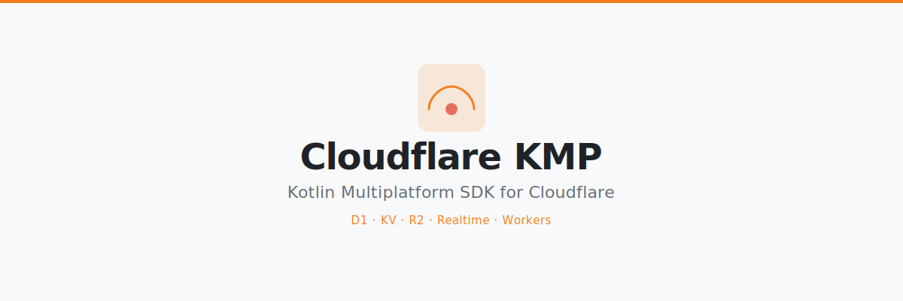

<p align="center">
  
</p>

<p align="center">
  
  
  
  
  
</p>

# Cloudflare KMP

Kotlin Multiplatform SDK and Worker gateway for Cloudflare — a type-safe, coroutine-first client for D1, KV, R2, and realtime-style app backends.

Cloudflare gives you powerful backend primitives, but not a mobile-safe `anonKey` model like Supabase. Cloudflare KMP adds that missing application layer:

```text
KMP app -> Cloudflare KMP SDK -> your Worker gateway -> D1 / KV / R2 / Durable Objects
```

Apps receive only a Worker URL and publishable key. Cloudflare account tokens, D1/KV/R2 bindings, and secrets stay server-side in your Worker.

## Status

This is an alpha scaffold. The SDK modules compile, the Kotlin/JS Worker dry-runs with Wrangler, and the Worker template implements D1 and KV routes.

Production gaps are explicit: R2 signing and Durable Object realtime are API-shaped but not fully implemented yet.

## Features

- **Safe app-facing credentials** — use `workerUrl` + `publishableKey`, never Cloudflare account API tokens in the app
- **Type-safe Result monad** — `CloudflareResult<T>` with `map`, `flatMap`, `recover`, `onSuccess`, and `onFailure`
- **D1 table API** — Supabase-style `from("todos").select<Todo>()`, `insert`, `update`, and `delete`
- **KV helpers** — read/write plain text or typed JSON through your Worker binding
- **R2 API shape** — signed upload/download URL client ready for Worker-side SigV4 implementation
- **Realtime API surface** — channel and broadcast model designed for Durable Object WebSockets
- **Kotlin/JS Worker template** — Kotlin-authored gateway compiled to a modern module Worker
- **Modular SDK** — install only the Cloudflare pieces your app needs

## Setup

Add the dependencies you need to your `build.gradle.kts`.

```kotlin
// Version catalog (gradle/libs.versions.toml)
[versions]
cloudflare-kmp = "0.1.0-alpha01"

[libraries]
cloudflare-core = { module = "io.github.androidpoet:cloudflare-core", version.ref = "cloudflare-kmp" }
cloudflare-client = { module = "io.github.androidpoet:cloudflare-client", version.ref = "cloudflare-kmp" }
cloudflare-d1 = { module = "io.github.androidpoet:cloudflare-d1", version.ref = "cloudflare-kmp" }
cloudflare-kv = { module = "io.github.androidpoet:cloudflare-kv", version.ref = "cloudflare-kmp" }
cloudflare-r2 = { module = "io.github.androidpoet:cloudflare-r2", version.ref = "cloudflare-kmp" }
cloudflare-realtime = { module = "io.github.androidpoet:cloudflare-realtime", version.ref = "cloudflare-kmp" }
```

```kotlin
// build.gradle.kts
kotlin {
    sourceSets {
        commonMain.dependencies {
            implementation(libs.cloudflare.client)    // includes cloudflare-core
            implementation(libs.cloudflare.d1)        // optional
            implementation(libs.cloudflare.kv)        // optional
            implementation(libs.cloudflare.r2)        // optional
            implementation(libs.cloudflare.realtime)  // optional
        }
    }
}
```

Until the first Maven Central release is visible, use `publishToMavenLocal` or a GitHub Packages/maven repository from your fork.

## Usage

### Create a Client

```kotlin
val cloudflare = createCloudflareClient(
    workerUrl = "https://api.example.workers.dev",
    publishableKey = "cfpub_live_xxx",
)
```

With user auth:

```kotlin
val cloudflare = createCloudflareClient(
    workerUrl = "https://api.example.workers.dev",
    publishableKey = "cfpub_live_xxx",
    accessTokenProvider = { sessionStore.currentAccessToken },
)
```

Every request sends:

```http
x-cloudflare-publishable-key: cfpub_live_xxx
Authorization: Bearer optional-user-token
```

### D1 — Table API

```kotlin
@Serializable
data class Todo(
    val id: String,
    val title: String,
    val done: Boolean,
)

val todos: CloudflareResult<List<Todo>> = cloudflare
    .d1()
    .from("todos")
    .select<Todo> {
        eq("done", "false")
        order("created_at", descending = true)
        limit(25)
    }

todos.onSuccess { items ->
    println("Got ${items.size} todos")
}.onFailure { error ->
    println("Error: ${error.message}")
}

// Optional: use Kotlin Result if you do not want CloudflareResult in app layers
val kotlinResult: Result<List<Todo>> = todos.toKotlinResult()
val backToSdk: CloudflareResult<List<Todo>> = kotlinResult.toCloudflareResult()
```

Insert:

```kotlin
cloudflare
    .d1()
    .from("todos")
    .insert(Todo(id = "todo_1", title = "Ship Cloudflare KMP", done = false))
```

Update:

```kotlin
cloudflare
    .d1()
    .from("todos")
    .update(Todo(id = "todo_1", title = "Ship Cloudflare KMP", done = true)) {
        eq("id", "todo_1")
    }
```

Delete:

```kotlin
cloudflare
    .d1()
    .from("todos")
    .delete {
        eq("id", "todo_1")
    }
```

### KV — Text and JSON

```kotlin
val kv = cloudflare.kv()

kv.putText("APP_KV", "settings/theme", "dark")

kv.get("APP_KV", "settings/theme").onSuccess { theme ->
    println(theme)
}
```

Typed JSON:

```kotlin
@Serializable
data class UserProfile(val name: String)

kv.putJson("APP_KV", "users/$userId/profile", UserProfile(name = "Ranbir"))

kv.getJson<UserProfile>("APP_KV", "users/$userId/profile")
```

### R2 — Signed URL API

```kotlin
cloudflare
    .r2()
    .createUploadUrl(
        bucket = "avatars",
        path = "users/$userId/avatar.png",
        contentType = "image/png",
    )
    .onSuccess { signedUrl ->
        println("Upload with ${signedUrl.method}: ${signedUrl.url}")
    }
```

The SDK API is present. The MVP Worker returns `501` for R2 routes until Worker-side SigV4 signing is implemented.

### Realtime — Durable Object Design

```kotlin
val realtime = createRealtimeClient(
    workerUrl = "https://api.example.workers.dev",
    publishableKey = "cfpub_live_xxx",
)

realtime.connect()

val subscription = realtime.subscribe("room:lobby") { event ->
    println("Event: $event")
}
```

Realtime is currently an API surface. The planned transport is Worker WebSockets backed by Durable Objects.

## Worker Gateway

The Worker template validates the publishable key and talks to Cloudflare bindings:

```text
GET    /health
GET    /d1/{table}?eq.id=123&limit=1
POST   /d1/{table}
PATCH  /d1/{table}?eq.id=123
DELETE /d1/{table}?eq.id=123
GET    /kv/{namespace}/{key}
POST   /kv/{namespace}/{key}
DELETE /kv/{namespace}/{key}
```

Dry-run the Worker:

```bash
./gradlew :worker-template:jsProductionExecutableCompileSync
cd worker-template
wrangler deploy --dry-run --outdir dist
```

Deploy after replacing the D1/KV IDs in `worker-template/wrangler.toml`:

```bash
cd worker-template
npm install
npm run build
wrangler deploy
```

## Modules

| Module | Purpose |
| --- | --- |
| `cloudflare-core` | Shared config, headers, `CloudflareResult`, errors |
| `cloudflare-client` | Ktor HTTP transport and client factory |
| `cloudflare-d1` | D1 table API |
| `cloudflare-kv` | KV text and JSON helpers |
| `cloudflare-r2` | R2 signed URL API shape |
| `cloudflare-realtime` | Realtime channel API surface |
| `worker-template` | Kotlin/JS Worker gateway |

## Docs

- [Getting Started](docs/getting-started.md)
- [Architecture](docs/architecture.md)
- [Security Model](docs/security.md)
- [API Reference](docs/api-reference.md)
- [Worker Deployment](docs/worker-deployment.md)
- [Publishing](docs/publishing.md)
- [Roadmap](docs/roadmap.md)

## Build

```bash
./gradlew :cloudflare-core:jvmTest \
  :cloudflare-client:compileKotlinJvm \
  :cloudflare-d1:compileKotlinJvm \
  :cloudflare-kv:compileKotlinJvm \
  :cloudflare-r2:compileKotlinJvm \
  :cloudflare-realtime:compileKotlinJvm \
  :worker-template:jsProductionExecutableCompileSync
```

## License

MIT License. See [LICENSE](LICENSE).
